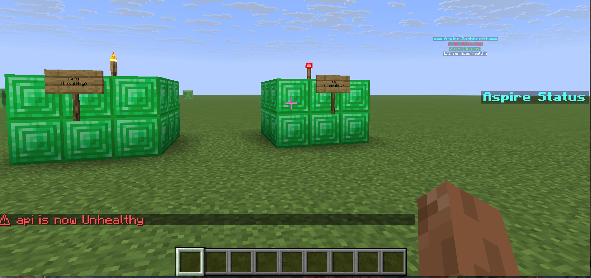

# 🎮 Aspire.Hosting.Minecraft

A .NET Aspire integration for Minecraft servers — featuring OpenTelemetry instrumentation, BlueMap web maps, and live in-world visualization of your Aspire resources.



## ✨ Features

- **Minecraft Server as an Aspire Resource** — `builder.AddMinecraftServer("minecraft")` with full lifecycle management
- **OpenTelemetry Instrumentation** — JVM metrics (memory, GC, threads) + game metrics (TPS, MSPT, players) in the Aspire dashboard
- **BlueMap Web Map** — Interactive 3D map exposed as a clickable endpoint in the dashboard
- **In-World Aspire Display** — Hologram dashboards, scoreboards, and torch-topped structures showing service health
- **Player Message Audit Trail** — Every system→player message logged as structured OTEL events

## 🚀 Quick Start

### Prerequisites

- .NET 10.0 SDK
- Docker Desktop
- A Minecraft Java Edition client (for connecting to the server)

### Run the Demo

```bash
cd samples/MinecraftAspireDemo/MinecraftAspireDemo.AppHost
dotnet run
```

This starts:
- A **Paper Minecraft server** (port 25565) with BlueMap and DecentHolograms plugins
- A **sample API service** and **web frontend** as sibling Aspire resources
- A **Redis cache** instance
- A **worker service** that renders Aspire state inside the Minecraft world

### Connect to the Server

1. Open Minecraft Java Edition
2. Add server: `localhost:25565`
3. Join and explore the Aspire dashboard near spawn!

## 📦 Usage in Your Own Project

```csharp
// In your AppHost Program.cs
using Aspire.Hosting.Minecraft;

var builder = DistributedApplication.CreateBuilder(args);

var redis = builder.AddRedis("cache");
var api = builder.AddProject<Projects.MyApi>("api");

var mc = builder.AddMinecraftServer("minecraft", gamePort: 25565, rconPort: 25575)
    .WithBlueMap(port: 8100)           // Adds BlueMap web map
    .WithOpenTelemetry()               // Injects OTEL Java agent for JVM telemetry
    .WithAspireWorldDisplay<Projects.Aspire_Hosting_Minecraft_Worker>()
    .WithMonitoredResource(api)        // Each monitored resource gets a cube,
    .WithMonitoredResource(redis);     // hologram line, and scoreboard entry

builder.Build().Run();
```

The worker service is created internally by `WithAspireWorldDisplay` — it appears as a child of the Minecraft resource in the Aspire dashboard. Add as many `.WithMonitoredResource()` calls as you like; each one dynamically gets its own in-world representation.

## 📊 Telemetry

### Automatic JVM Metrics (via OTEL Java Agent)

| Metric | Description |
|--------|-------------|
| `jvm.memory.used` | Heap/non-heap memory by pool |
| `jvm.gc.collections.count` | GC invocations per collector |
| `jvm.gc.collections.duration` | Time spent in GC pauses |
| `jvm.threads.live` | Current thread count |
| `process.cpu.utilization` | JVM CPU usage |

### Game Metrics (via RCON polling)

| Metric | Description |
|--------|-------------|
| `minecraft.tps` | Server ticks per second (target: 20.0) |
| `minecraft.mspt` | Milliseconds per tick |
| `minecraft.players.online` | Current player count |
| `minecraft.players.max` | Max player slots |
| `minecraft.worlds.loaded` | Number of loaded worlds |
| `minecraft.rcon.latency_ms` | RCON round-trip time |
| `minecraft.player_messages.sent` | System messages sent to players |

### Structured Logs

All system→player messages are logged with rich context:
```
[INF] Player message sent: {MessageType=ResourceHealthAlert, ResourceName=redis, Trigger=HealthChanged}
```

## 🏗️ Architecture

```
AppHost
  ├── Minecraft Server (Docker: itzg/minecraft-server)
  │     ├── Paper Server + BlueMap + DecentHolograms
  │     ├── OTEL Java Agent → Aspire Dashboard
  │     └── Ports: 25565 (game), 8100 (map), 25575 (RCON)
  │
  ├── Minecraft Worker Service (.NET)
  │     ├── RCON connection to server
  │     ├── Game metrics polling → OTEL
  │     ├── Hologram dashboards
  │     ├── Scoreboards
  │     ├── Torch structures per resource
  │     └── Player message audit logging
  │
  └── Your Services (API, Web, Redis, etc.)
        └── Visualized in-world!
```

## 🔧 Configuration

The `AddMinecraftServer` method accepts optional parameters:

```csharp
builder.AddMinecraftServer("minecraft",
    gamePort: 25565,    // Minecraft game port
    rconPort: 25575);   // RCON console port
```

## 📁 Project Structure

```
src/
  Aspire.Hosting.Minecraft/        # Hosting library (NuGet package — includes RCON client)
  Aspire.Hosting.Minecraft.Rcon/   # RCON protocol client library (embedded in hosting package)
  Aspire.Hosting.Minecraft.Worker/ # Worker service for in-world display (separate project, not packaged)
samples/
  MinecraftAspireDemo/             # Demo application
```

## License

MIT
